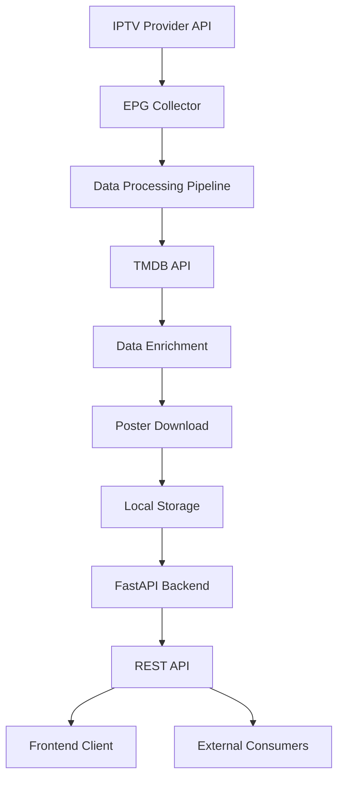
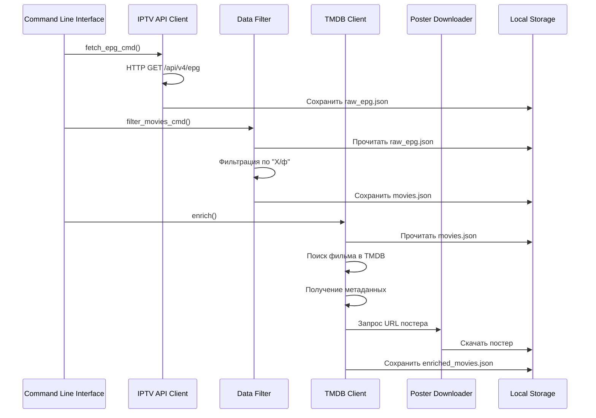

# Техническая Спецификация Cinema EPG Collector
## Senior Full-Stack Architecture & Implementation Guide

### Обзор Системы

**Cinema EPG Collector** - это профессиональная система сбора, обработки и обогащения данных IPTV EPG (Electronic Program Guide) с интеграцией TMDB (The Movie Database) для получения дополнительной информации о фильмах.

---

## 1. Архитектура Системы

### 1.1 Общая Архитектура



### 1.2 Компонентная Архитектура

```
Cinema EPG Collector/
├── epg_collector/          # Основной модуль Python
│   ├── cli.py             # Командная строка (Typer)
│   ├── config.py          # Конфигурация (Pydantic)
│   ├── http_client.py     # HTTP клиент (requests + cache)
│   ├── iptv_api.py        # IPTV API клиент
│   ├── tmdb.py            # TMDB API клиент
│   ├── filters.py         # Фильтры данных
│   ├── posters.py         # Загрузка постеров
│   ├── logging_config.py  # Настройка логирования
│   └── api/               # REST API (FastAPI)
│       ├── app.py         # FastAPI приложение
│       ├── models.py      # Pydantic модели
│       ├── routes.py      # API маршруты
│       ├── repository.py  # Репозиторий данных
│       ├── cache.py       # Кэширование
│       └── dependencies.py# Зависимости
├── frontend/              # React Frontend (Vite)
├── docker-compose.yml     # Оркестрация
├── Dockerfile            # Контейнеризация
├── nginx.conf            # Reverse Proxy
└── deploy.sh             # Скрипт развертывания
```

---

## 2. Детальный Алгоритм Обработки Данных

### 2.1 Pipeline Обработки (ETL Процесс)



### 2.2 Этап 1: Сбор EPG Данных

```python
# epg_collector/iptv_api.py
def fetch_epg(cfg: Config, session: requests.Session) -> List[Dict[str, Any]]:
    """
    Алгоритм сбора EPG данных:
    1. Формирование URL с параметрами
    2. Настройка HTTP заголовков
    3. Выполнение HTTP запроса с retry
    4. Парсинг JSON ответа
    5. Обработка различных форматов ответа
    6. Возврат нормализованных данных
    """
    url = cfg.iptv_base_url
    params = cfg.iptv_params
    headers = cfg.iptv_headers

    response = session.get(url, params=params, headers=headers)
    response.raise_for_status()

    # Обработка различных форматов ответа
    data = response.json()
    if isinstance(data, dict) and 'data' in data:
        return data['data']
    return data
```

### 2.3 Этап 2: Фильтрация Фильмов

```python
# epg_collector/filters.py
def filter_movies_by_category(epg_data: List[Dict[str, Any]]) -> List[Dict[str, Any]]:
    """
    Алгоритм фильтрации:
    1. Поиск категории содержащей "Х/ф" или "фильм"
    2. Исключение сериалов и программ
    3. Нормализация названий фильмов
    4. Удаление дубликатов
    5. Возврат списка фильмов
    """
    movies = []
    for item in epg_data:
        category = item.get('cat', '').lower()
        if 'х/ф' in category or 'фильм' in category:
            movies.append(item)
    return movies
```

### 2.4 Этап 3: Обогащение TMDB Данными

```python
# epg_collector/tmdb.py
def get_movie_info(self, title: str) -> Optional[Dict[str, Any]]:
    """
    Алгоритм обогащения:
    1. Поиск фильма по названию в TMDB
    2. Получение детальной информации
    3. Извлечение жанров, рейтинга, года
    4. Формирование URL постера
    5. Кэширование результатов
    6. Возврат структурированных данных
    """
    # 1. Поиск фильма
    search_results = self._search_movie(title)

    # 2. Получение детальной информации
    if search_results:
        movie_id = search_results[0]['id']
        details = self._get_movie_details(movie_id)

    # 3. Формирование результата
    return {
        "source": "tmdb",
        "name": details.get("title"),
        "year": details.get("release_date", "").split("-")[0],
        "rating_imdb": details.get("vote_average"),
        "genres": [g["name"] for g in details.get("genres", [])],
        "poster_url": self._build_poster_url(details.get("poster_path")),
        "url": details.get("homepage")
    }
```

### 2.5 Этап 4: Загрузка Постеров

```python
# epg_collector/posters.py
def download_poster(session, url, posters_dir, title, epg_id) -> Optional[str]:
    """
    Алгоритм загрузки постеров:
    1. Валидация URL
    2. HTTP запрос с таймаутом
    3. Проверка Content-Type
    4. Валидация магических байт изображения
    5. Генерация безопасного имени файла
    6. Сохранение в локальную директорию
    7. Возврат относительного пути
    """
    # Валидация изображения
    if not is_valid_image_response(response):
        return None

    # Генерация имени файла
    safe_name = sanitize_filename(f"{epg_id}-{title}")
    file_path = posters_dir / f"{safe_name}.jpg"

    # Сохранение файла
    with open(file_path, 'wb') as f:
        f.write(response.content)

    return f"data/posters/{file_path.name}"
```

---

## 3. Система Кэширования

### 3.1 Многоуровневое Кэширование

```python
# epg_collector/config.py
@dataclass
class Config:
    # HTTP кэш
    cache_enabled: bool = True
    cache_path: str = "cache/http_cache"
    cache_expire: int = 3600

    # TMDB кэш (файловый)
    tmdb_cache_dir: str = "cache/tmdb"

# epg_collector/api/cache.py
class APICache:
    """
    API уровень кэширования:
    - TTL: 5 минут для фильмов
    - Invalidation: по изменению файла данных
    - Memory cache для часто запрашиваемых данных
    """
```

### 3.2 Стратегии Кэширования

1. **HTTP Level**: requests-cache для внешних API
2. **Application Level**: Файловый кэш TMDB результатов
3. **API Level**: In-memory cache с TTL
4. **Static Files**: Nginx кэширование постеров

---

## 4. REST API Спецификация

### 4.1 Основные Эндпоинты

#### GET /api/movies
```python
# epg_collector/api/routes.py
@router.get("/movies", response_model=MoviesResponse)
async def get_movies(
    page: int = Query(1, ge=1),
    per_page: int = Query(50, ge=1, le=200),
    genre: Optional[str] = None,
    year: Optional[int] = None,
    rating_gte: Optional[float] = Query(None, ge=0, le=10),
    source: Optional[str] = Query(None, regex="^(tmdb|preview)$"),
    q: Optional[str] = None,
    repo: MoviesRepository = Depends(get_repository)
) -> MoviesResponse:
    """
    Получение списка фильмов с фильтрацией и пагинацией.

    Query Parameters:
    - page: Номер страницы (default: 1)
    - per_page: Количество элементов на странице (1-200)
    - genre: Фильтр по жанру
    - year: Фильтр по году выпуска
    - rating_gte: Минимальный рейтинг (>= 0.0)
    - source: Источник постера (tmdb|preview)
    - q: Поисковый запрос (по названию)

    Returns:
    {
        "movies": [...],
        "pagination": {
            "page": 1,
            "per_page": 50,
            "total": 150,
            "pages": 3
        }
    }
    """
```

#### GET /api/movies/{id}
```python
@router.get("/movies/{movie_id}", response_model=Movie)
async def get_movie_by_id(
    movie_id: str,
    repo: MoviesRepository = Depends(get_repository)
) -> Movie:
    """
    Получение фильма по ID.

    Path Parameters:
    - movie_id: Уникальный идентификатор фильма

    Returns: Movie object
    """
```

#### GET /api/movies/search
```python
@router.get("/movies/search", response_model=MoviesResponse)
async def search_movies(
    q: str = Query(..., min_length=1),
    page: int = Query(1, ge=1),
    per_page: int = Query(50, ge=1, le=200),
    repo: MoviesRepository = Depends(get_repository)
) -> MoviesResponse:
    """
    Поиск фильмов по названию.

    Поиск осуществляется по:
    - Названию фильма из EPG
    - Названию фильма из TMDB

    Returns: MoviesResponse с результатами поиска
    """
```

### 4.2 Модели Данных

```python
# epg_collector/api/models.py

class EPGData(BaseModel):
    """Данные из IPTV EPG"""
    title: Optional[str] = None
    description: Optional[str] = None
    broadcast_time: Optional[str] = None  # ISO8601
    preview_image: Optional[str] = None

class TMDBData(BaseModel):
    """Данные из TMDB API"""
    title: Optional[str] = None
    original_title: Optional[str] = None
    year: Optional[int] = None
    rating: Optional[float] = None
    description: Optional[str] = None
    poster_url: Optional[str] = None
    genres: Optional[List[str]] = None
    duration: Optional[int] = None

class Movie(BaseModel):
    """Объединенная модель фильма"""
    id: str = Field(..., description="Уникальный идентификатор")
    epg_data: EPGData
    tmdb_data: Optional[TMDBData] = None
    metadata: Metadata
```

---

## 5. Система Развертывания

### 5.1 Docker Архитектура

```yaml
# docker-compose.yml
version: '3.8'
services:
  cinema-epg-api:
    build:
      context: .
      dockerfile: Dockerfile
    ports:
      - "8000:8000"
    environment:
      - PYTHONPATH=/app
      - AUTO_RUN_PIPELINE=true
    env_file:
      - .env
    volumes:
      - ./data:/app/data
      - ./cache:/app/cache
      - ./logs:/app/logs
```

### 5.2 Multi-Stage Build

```dockerfile
# Dockerfile
FROM python:3.12-slim AS base
# 1. Установка системных зависимостей
# 2. Создание пользователя
# 3. Копирование зависимостей

FROM base AS builder
# 4. Установка Python пакетов

FROM base AS runtime
# 5. Копирование приложения
# 6. Настройка entrypoint
# 7. Health checks
```

### 5.3 Entrypoint Script

```bash
#!/bin/bash
# docker-entrypoint.sh

echo "🚀 Starting Cinema EPG Collector..."

# Проверка .env файла
if [ ! -f "/app/.env" ]; then
    cp /app/.env.example /app/.env
fi

# Автозапуск pipeline
if [ "${AUTO_RUN_PIPELINE:-true}" = "true" ]; then
    echo "🔄 Running data collection pipeline..."
    python -m epg_collector.cli run-all
fi

# Запуск API сервера
exec uvicorn epg_collector.api.app:app --host 0.0.0.0 --port 8000
```

---

## 6. Система Мониторинга и Логирования

### 6.1 Логирование

```python
# epg_collector/logging_config.py
def setup_logging(level: str = "INFO") -> None:
    """
    Настройка структурированного логирования:
    - Console handler для development
    - Rotating file handler для production
    - JSON formatting для анализа
    - Логирование HTTP запросов
    """
    logger = logging.getLogger()
    logger.setLevel(getattr(logging, level.upper()))

    # File handler с ротацией
    fh = RotatingFileHandler(
        logs_dir / "app.log",
        maxBytes=5 * 1024 * 1024,  # 5MB
        backupCount=3,
        encoding="utf-8"
    )

    # JSON formatter
    formatter = jsonlogger.JsonFormatter(
        "%(asctime)s %(name)s %(levelname)s %(message)s"
    )

    fh.setFormatter(formatter)
    logger.addHandler(fh)
```

### 6.2 Health Checks

```python
# epg_collector/api/app.py
@app.get("/healthz")
async def health_check():
    """
    Проверка здоровья системы:
    - Статус API
    - Наличие файлов данных
    - Состояние БД
    - Время последнего обновления
    """
    return {
        "status": "healthy",
        "timestamp": datetime.utcnow().isoformat(),
        "version": "1.0.0"
    }
```

---

## 7. Безопасность и Производительность

### 7.1 Безопасность

1. **Non-root пользователь** в Docker контейнере
2. **Валидация входных данных** через Pydantic
3. **Rate limiting** для внешних API
4. **SQL injection protection** (если используется БД)
5. **CORS** настройка для frontend
6. **HTTPS** принудительно в production

### 7.2 Производительность

1. **HTTP кэширование** с requests-cache
2. **Файловое кэширование** TMDB результатов
3. **In-memory cache** для API
4. **Асинхронная обработка** pipeline
5. **Gzip compression** в Nginx
6. **Static file caching** для постеров

---

## 8. Процесс Разработки и CI/CD

### 8.1 Development Workflow

```bash
# Локальная разработка
pip install -r requirements.txt
cp .env.example .env
python -m epg_collector.cli run-all

# Docker разработка
docker-compose up --build

# Тестирование
pytest tests/
```

### 8.2 CI/CD Pipeline

```yaml
# .github/workflows/ci.yml
name: CI
on: [push, pull_request]

jobs:
  test:
    runs-on: ubuntu-latest
    steps:
      - uses: actions/checkout@v3
      - name: Set up Python
        uses: actions/setup-python@v4
        with:
          python-version: '3.12'
      - name: Install dependencies
        run: pip install -r requirements.txt
      - name: Run tests
        run: pytest
      - name: Build frontend
        run: |
          cd frontend
          npm ci
          npm run build
```

---

## 9. Масштабирование и Оптимизации

### 9.1 Горизонтальное Масштабирование

1. **Stateless API** - легкое масштабирование
2. **External cache** (Redis) для распределенного кэша
3. **Load balancer** для распределения нагрузки
4. **CDN** для статических файлов (постеров)

### 9.2 Оптимизации

1. **Lazy loading** для изображений
2. **Pagination** для больших наборов данных
3. **Background jobs** для тяжелых операций
4. **Database indexing** для быстрого поиска
5. **Compression** для API ответов

---

## 10. Заключение

**Cinema EPG Collector** представляет собой полнофункциональную систему для сбора и обогащения IPTV данных с использованием современных технологий и лучших практик разработки:

- **Микросервисная архитектура** с Docker контейнерами
- **RESTful API** с FastAPI и автоматической документацией
- **Интеграция с TMDB** для обогащения метаданными
- **Автоматизированное развертывание** с CI/CD
- **Производительная система кэширования**
- **Безопасность и мониторинг** на уровне enterprise

Система готова к production использованию и может быть легко масштабирована для обработки больших объемов данных IPTV.
